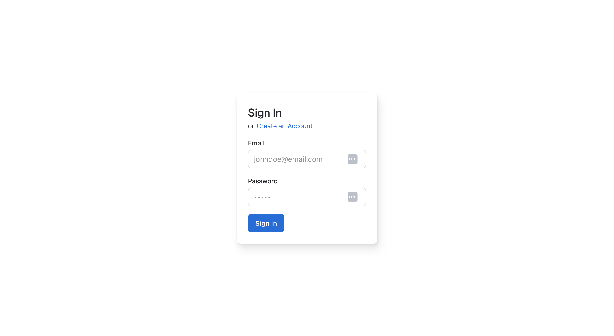
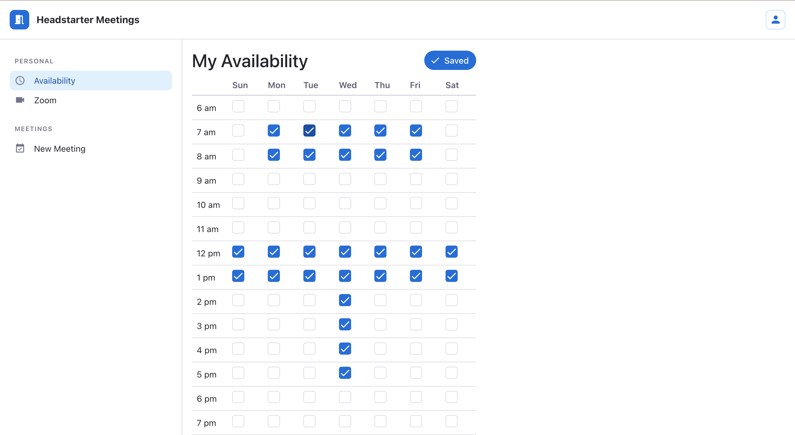
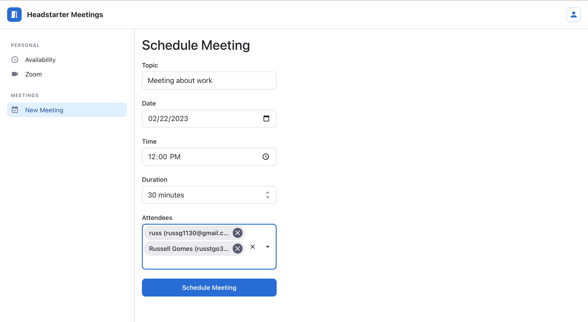

# Company Case - Headstarter 

A Platform where groups in Headstarter will be able to schedule times to meet on a Calendar and video call each other on the platform.

## Table of Contents

- [About](#about)
- [Getting Started](#getting_started)
- [Installing](#installing)
- [Usage](#usage)
- [Contributing](#contributing)
- [Languages](#languages)

## About
The features include are: 
1. React Platform with user authentication where people can log in and set up meetings with other members
2. Shared calendar scheduler for users to input the times they are not available 
3. Connectivity to Zoom accounts for groups to easily be able to video conference
4. Schedule team meetings on the calendar and send email (or some notification) to user before meeting


## Getting Started
These instructions will get you a copy of the project up and running on your local machine for development and testing purposes.

## Installing
Installation instructions.
1. Clone Template

```
git clone https://github.com/john-royal/headstarter-meetings
```

2. Install Packages

```
pnpm install
```

3. Start Project

```
npm run dev
```

4. If you using git, delete the existing folder .git after cloning (open `git bash` or other terminal)

```
rm -rf .git
```

## Usage

1. Sign in to your account or sign up if you are just starting


2. Input times at which you are available in the availability page

3. Connect your "headstarter meetings" account to your Zoom account by clicking the Zoom option in the side-menu

 
4. Set up a meeting with other members. To make sure times line up, an error message will indicate if anyone is unavailable 


## Contributing
Contributors names.
- John Royal
- Maaz Hussaini
- Russell Gomes

## Languages

Vite TypeScript React


